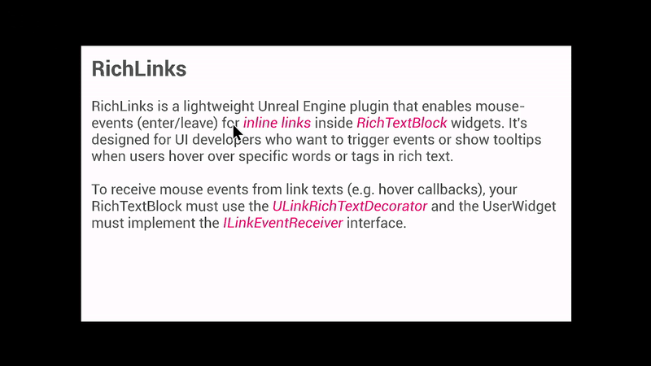

# RichLinks


**RichLinks** is a lightweight Unreal Engine plugin that enables mouse-events (enter/leave) for inline links inside `URichTextBlock` widgets. It's designed for UI developers who want to trigger events or show tooltips when users hover over specific words or tags in rich text.

## Features

- Adds `<link>` tag support with real mouse-events (enter/leave)
- Clean integration with `URichTextBlock` via decorator
- Easy to use in both C++ and Blueprint widgets
- Tested with Unreal Engine 5.3

## Installation

1. Clone or copy this repository into your project’s `Plugins/` directory.
2. Regenerate project files and reopen the project.
3. Enable the **RichLinks** plugin in the editor.
4. Add the `ULinkRichTextBlockDecorator` to your `URichTextBlock`.

## Usage Example

```
This is an <link id="example">example link</>.
```

You can respond to hover events directly from Slate or use Blueprint interfaces to receive callbacks.

## Demo
```
./Plugins
  └─RichLinks
    └─Content
      └─Demo
        ├─BP_WidgetActor.uasset
        ├─DT_RichTextStyle.uasset
        ├─L_WidgetActor_World.umap
        ├─L_Widget_Viewport.umap    // start here 
        └─W_PlainRichText.uasset
```

### L_Widget_Viewport

1. Open `L_Widget_Viewport`
2. Press *play-in-editor* (Alt+P)
3. Use the mouse to hover and click the links




### W_PlainRichText

1. Open `W_PlainRichText`
2. In the Designer tab checkout `Rich Text Block` 
3. Notice that a Text Style Set must be applied, here `DT_RichTextStyle`
4. Under Decorator classes the LinkRichTextDecorator is necessary for the links to work
3. In the Graph tab checkout how ILinkEventReceiver is implemented

You can create your own interfaces that implement ILinkEventReceiver and react to the link events `NotifyOnLinkMouseEnter`, `NotifyOnLinkMouseLeave` and `NotifyOnLinkMouseButtonDown` accordingly. For example *OnMouseEnter*/*OnMouseClose*, you could open/close another Widget as a tooltip and pass-in the linkId for the tooltip to display the correct information.

### L_WidgetActor_World

1. Open `L_WidgetActor_World`
2. Press *play-in-editor* (Alt+P)
3. Use the mouse to hover and click the links

This map contains a `BP_WidgetActor` placed in the world.


