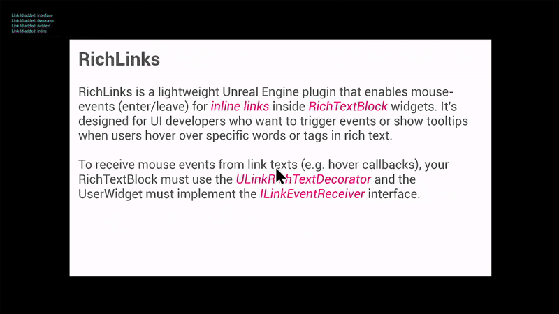

# RichLinks


This is the official documentation for the RichLinks plugin on the Fab marketplace.

---

**RichLinks** is a lightweight Unreal Engine 5 plugin that enables mouse-events (enter/leave/click) for inline links inside `URichTextBlock` widgets. It's designed for UI developers who want to trigger events or show tooltips when users hover over specific words or tags in rich text.

## Features

- Adds `<link>` tag support with real mouse-events (enter/leave/click)
- Clean integration with `URichTextBlock` via decorator
- Easy to use in both C++ and Blueprint widgets
- Tested with Unreal Engine 5.3

## Installation

1. Copy `./Plugins/RichLinks` into your project’s `./Plugins` directory.
2. Regenerate project files and reopen the project.
3. Enable the **RichLinks** plugin in the editor under Edit -> Plugins.


## Getting Started

Add the `ULinkRichTextBlockDecorator` to your `URichTextBlock`. Use the following tag to enable RichLink functionality:

```
This is an <link id="example">example link</>.
```

You can handle hover events directly through Slate or use Blueprint interfaces to receive callbacks.

### Example Widget

1. Open `W_PlainRichText`
2. In the Designer tab, check out the `Rich Text Block`
3. Notice that a Text Style Set must be applied, here `DT_RichTextStyle`
4. Under Decorator classes, the `LinkRichTextDecorator` is required
3. In the Graph tab, check out how `ILinkEventReceiver` is implemented

You can create your own interfaces that implement `ILinkEventReceiver` and react to the link events `NotifyOnLinkMouseEnter`, `NotifyOnLinkMouseLeave` and `NotifyOnLinkMouseButtonDown` accordingly. For example *OnMouseEnter* / *OnMouseLeave*, you could spawn/destroy another WidgetActor as a tooltip and pass in the `linkId` for the tooltip to display the correct information.


## Demo
```
./Plugins
  └─RichLinks
    └─Content
      └─Demo
        ├─BP_WidgetActor.uasset
        ├─DT_RichTextStyle.uasset
        ├─L_WidgetActor_World.umap
        ├─L_Widget_Viewport.umap    // Start here 
        └─W_PlainRichText.uasset
```

### L_Widget_Viewport

1. Open `L_Widget_Viewport`
2. Press *play-in-editor* (Alt+P)
3. Use the mouse to hover and click the links



### L_WidgetActor_World

1. Open `L_WidgetActor_World`
2. Press *play-in-editor* (Alt+P)
3. Use the mouse to hover and click the links

This map contains a `BP_WidgetActor` placed in the world.


## License

This plugin is released under the [MIT License](LICENSE). You are free to use, modify, and distribute it in both commercial and non-commercial projects.

## Support & Feedback

Found a bug or have a feature request? Please open an issue on [GitHub Issues](https://github.com/kaijurgeit/UE5RichLinksPlugin/issues).
